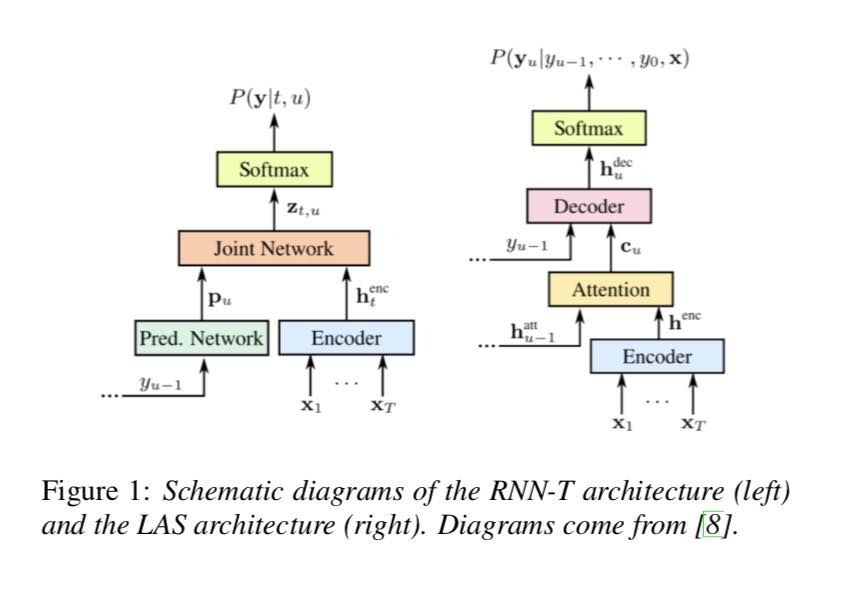
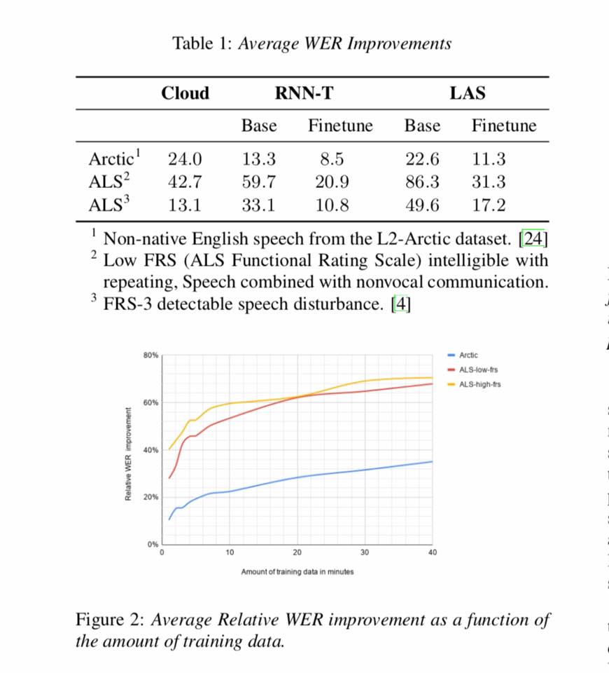
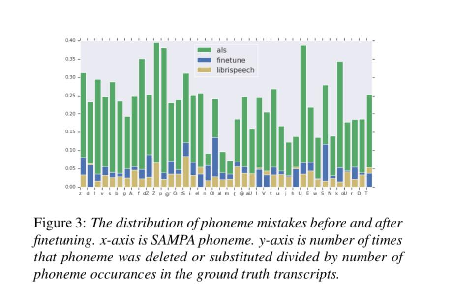

# Automatic-speech-recognition-ASR-systems-from-googleAI-and-ALSTDI

Speak better with Artificial Intelligence - Automatic speech recognition (ASR) systems from @googleAI and @ALSTDI
work, Project Euphonia for slurred speech and those with accents. 

It is a speech-to-text transcription service for people with speaking impairments. 

71% of the improvement comes from only five minutes of training data.

Read at https://arxiv.org/pdf/1907.13511.pdf
